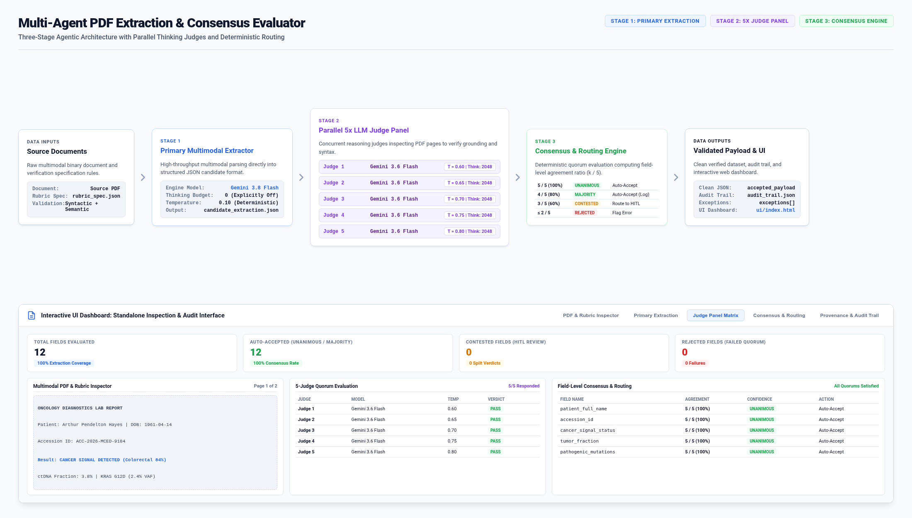

# Multi-Agent PDF Extraction and Consensus Evaluator

A production-grade, agentic document intelligence system that extracts structured data from raw PDF files, evaluates candidate extractions using an ensemble panel of five parallel thinking-enabled LLM judges, and deterministically computes field-level consensus scores and routing decisions.

Compatible with any modern AI agent harness supporting standard agent skills, plugins, and interactive UI dashboard rendering.



---

## System Overview and Architecture

High-stakes document extraction requires both high throughput and rigorous validation to eliminate hallucinations, field transpositions, and formatting errors. This project implements a three-stage pipeline:

```
[Input PDF Document + Target Extraction Rubric]
                       |
                       v
+---------------------------------------------------------+
| Stage 1: Primary Multimodal Extraction                  |
| - Engine: Gemini 3.8 Flash (Thinking Budget: 0)         |
| - Low temperature (0.1) for high precision parsing      |
| - Output: candidate_extraction.json                     |
+--------------------------+------------------------------+
                           |
                           v
+---------------------------------------------------------+
| Stage 2: Parallel 5x LLM-as-a-Judge Panel               |
| - Engine: 5x Gemini 3.6 Flash (Thinking Budget: 2048+)  |
| - Inputs: Source PDF + Candidate JSON + Rubric Rules    |
| - Non-blocking concurrent execution (asyncio)           |
| - Output: 5 distinct structured evaluation payloads     |
+--------------------------+------------------------------+
                           |
                           v
+---------------------------------------------------------+
| Stage 3: Deterministic Consensus and Routing Engine     |
| - Calculate field agreement ratio (k / 5 passes)        |
| - Classify confidence: UNANIMOUS, MAJORITY, CONTESTED,  |
|   or REJECTED                                           |
| - Output: Validated JSON + Exception Report + Audit Log |
+---------------------------------------------------------+
```

### Stage Details

1. **Stage 1: Primary Multimodal Extraction**
   - High-throughput multimodal parsing using `gemini-3.8-flash` with thinking budget set to 0.
   - Converts the verification rubric criteria into structural schema instructions.
   - Emits a raw candidate JSON payload.

2. **Stage 2: Parallel LLM-as-a-Judge Panel**
   - Spawns five parallel, isolated judge calls using `gemini-3.6-flash` with active reasoning (`thinking_budget: 2048` tokens) and sample diversity.
   - Evaluates syntactic rules (data types, regex patterns, token lengths) and visual semantic grounding against the original PDF pages.
   - Detects specific failure modes (e.g., `HALLUCINATION`, `FORMAT_MISMATCH`, `FACILITY_ADDRESS_CONFUSED_AS_PATIENT`, `DIGIT_TRANSPOSITION`, `SECONDARY_CODE_EXTRACTED_AS_PRIMARY`).

3. **Stage 3: Deterministic Consensus and Routing**
   - Post-processes judge verdicts into consensus metrics without extra model calls.
   - Classification and routing table:

| Agreement Count (k / 5) | Status Classification | Confidence Band | Recommended Routing Action |
| :--- | :--- | :--- | :--- |
| 5 / 5 | UNANIMOUS_PASS | Extreme Confidence (>= 98%) | Auto-Accept |
| 4 / 5 | MAJORITY_PASS | High Confidence (90-95%) | Auto-Accept with Warning (log single dissent) |
| 3 / 5 | CONTESTED | Split Verdict (~60%) | Route to Human-in-the-Loop (HITL) |
| <= 2 / 5 | REJECTED | Low Confidence / Failure | Flag for Extraction Failure / Resubmission |

---

## Interactive UI Dashboard

The skill generates a standalone, responsive UI dashboard (`ui/index.html`) upon executing the pipeline on an input PDF and rubric specification. It renders natively inside standard web browsers and iframe-capable agent environments, structured across five tabs from left to right:

1. **PDF & Rubric Inspector**: High-fidelity multi-page PDF rendering with page switching alongside interactive rubric rules.
2. **Primary Extraction**: Inspects candidate extracted fields, token budgets, and model parameters.
3. **Judge Panel Matrix**: 5-column visualization of the parallel judge workers, displaying reasoning tokens, verdicts, and failure mode citations.
4. **Consensus & Routing**: Statistical summary cards, field consensus ratios, confidence tiers, and validated clean payload.
5. **Provenance & Audit Trail**: Complete JSON audit trail viewer with copy and export functionality.

- **Theme Toggle**: Switch between Light and Dark modes with persistent preferences.

---

## Directory Structure

```
pdf-llm-as-judge-skill/
├── SKILL.md                                        # Main skill instruction file for AI agents
├── plugin.json                                     # Plugin registration manifest
├── README.md                                       # Project documentation
├── pyproject.toml                                  # Python package configuration
├── LICENSE                                         # Apache 2.0 license
├── assets/
│   └── pipeline_workflow_dashboard.png             # Architecture pipeline and dashboard diagram
├── output/
│   ├── test_cancer_screening_dashboard.html        # Sample generated HTML UI dashboard
│   └── test_cancer_screening_evaluation.json       # Sample generated evaluation report
├── ui/
│   └── index.html                                  # Standalone interactive UI Dashboard
├── scripts/
│   ├── run_pipeline.py                             # Command-line entry point for full pipeline
│   └── evaluate_candidate.py                       # Evaluation-only script for pre-extracted candidate
├── pdf_consensus_evaluator/
│   ├── __init__.py                                 # Package root and public exports
│   ├── models.py                                   # Schemas, dataclasses, and enums
│   ├── gemini_client.py                            # Multimodal API client with mock engine
│   ├── stage1_extractor.py                         # Stage 1 primary multimodal extractor
│   ├── stage2_judge_panel.py                       # Stage 2 parallel 5x judge panel
│   ├── stage3_consensus.py                         # Stage 3 deterministic consensus aggregator
│   ├── dashboard_generator.py                      # HTML Dashboard generator
│   ├── pipeline.py                                 # End-to-end pipeline orchestrator
│   └── cli.py                                      # Command-line interface logic
├── samples/
│   ├── healthcare_patient_intake_form.pdf          # Patient intake form sample PDF
│   ├── rubric_spec_healthcare_patient_intake_form.json # Intake form rubric specification
│   ├── expected_candidate_healthcare_patient_intake_form.json # Intake form reference extraction
│   ├── cancer_screening_lab_report.pdf             # Cancer screening molecular diagnostics PDF
│   ├── rubric_spec_cancer_screening_lab_report.json # Cancer screening rubric specification
│   └── expected_candidate_cancer_screening_lab_report.json # Cancer screening reference extraction
└── tests/
    ├── __init__.py                                 # Test package root
    ├── test_models.py                              # Schema and deserialization tests
    ├── test_consensus.py                           # Consensus calculation and quorum tests
    ├── test_synthetic_discrepancies.py             # Error injection and rejection tests
    └── test_pipeline_e2e.py                        # End-to-end integration and dashboard tests
```

---

## Data Privacy and Synthetic Data Notice

All sample files provided in the `samples/` directory are completely synthetic and generated for demonstration and testing purposes. They contain no real personal data or Protected Health Information (PHI).

---

## Installation and Prerequisites

### Requirements
- Python 3.10 or higher
- `requests`, `pypdf`, `pyyaml`, `pytest`

### Setup

1. Clone or copy the repository into your workspace:
   ```bash
   cd pdf-llm-as-judge-skill
   ```

2. Authentication (choose either Google Cloud or Google AI Studio):
   - **Google Cloud Vertex AI (Default / Enterprise)**:
     ```bash
     gcloud auth application-default login
     # Project ID is automatically detected from active gcloud config or GOOGLE_CLOUD_PROJECT
     export GOOGLE_CLOUD_PROJECT="your-gcp-project-id" # optional if gcloud is configured
     ```
   - **Google AI Studio (Alternative)**:
     ```bash
     export GEMINI_API_KEY="your-gemini-api-key"
     ```

---

## How to Run the Python Code

### 1. Running the Full Pipeline via CLI (with UI Dashboard)

Run the full extraction and consensus pipeline on a PDF and rubric, exporting both JSON and the HTML UI dashboard:

```bash
python3 scripts/run_pipeline.py \
  --pdf samples/healthcare_patient_intake_form.pdf \
  --rubric samples/rubric_spec_healthcare_patient_intake_form.json \
  --output output/extraction_report.json \
  --dashboard ui/index.html
```

### 2. Evaluating an Existing Candidate Extraction

If you already have candidate extraction JSON and want to run the 5x Judge Panel and Consensus Engine:

```bash
python3 scripts/evaluate_candidate.py \
  --pdf samples/healthcare_patient_intake_form.pdf \
  --rubric samples/rubric_spec_healthcare_patient_intake_form.json \
  --candidate-json samples/expected_candidate_healthcare_patient_intake_form.json \
  --output output/evaluation_report.json \
  --dashboard ui/index.html
```

### 3. Advanced CLI Options

| Flag | Type | Default | Description |
| :--- | :--- | :--- | :--- |
| `--pdf` | String | (Required) | Path to input PDF file |
| `--rubric` | String | (Required) | Path to JSON rubric specification file |
| `--candidate-json` | String | `None` | Pre-extracted candidate JSON (evaluates candidate directly) |
| `--output` | String | `None` | File path to write full JSON report |
| `--dashboard` | String | `None` | File path to generate HTML UI Dashboard |
| `--api-key` | String | `None` | Explicit API key (overrides `GEMINI_API_KEY`) |
| `--extractor-model` | String | `gemini-3.8-flash` | Model for primary extraction |
| `--judge-model` | String | `gemini-3.6-flash` | Model for judge panel |
| `--thinking-budget` | Integer | `2048` | Reasoning budget token count for judges |
| `--num-judges` | Integer | `5` | Number of concurrent judges in panel |
| `--min-pass-ratio` | Float | `0.8` | Pass ratio threshold for auto-accept |
| `--verbose`, `-v` | Flag | `False` | Enable debug logging |

---

## Running the Automated Test Suite

Run unit, integration, dashboard generation, and synthetic error injection tests using `pytest`:

```bash
pytest -v tests/
```

### Test Coverage Summary:
- `test_models.py`: Validates rubric parsing, syntactic rules, and judge payload deserialization.
- `test_consensus.py`: Tests mathematical consensus logic across all confidence tiers (5/5, 4/5, 3/5, 2/5, 1/5, 0/5) and degraded quorums.
- `test_synthetic_discrepancies.py`: Injects invalid SSNs and clinic address mix-ups to verify majority rejection and failure mode attribution.
- `test_pipeline_e2e.py`: Executes end-to-end pipeline against the sample PDF and generates the UI Dashboard.

---

## Using the Skill in an Agent Harness

This project is packaged as a standard agent skill (`SKILL.md` and `plugin.json`) compatible with modern AI agent harnesses, orchestration frameworks, and interactive UI dashboards.

### Step-by-Step Instructions for Non-Technical Users

1. **Provide Input Files**: Place your source PDF and corresponding rubric JSON file into an accessible directory (such as `samples/` or your workspace folder).
2. **Send Prompt in Chat**: Instruct the agent in natural language to process the PDF using the rubric and run the 5-judge consensus evaluator.
3. **Review Extracted Results & UI Dashboard**: The agent runs the pipeline and outputs:
   - High-confidence accepted fields that achieved 5/5 or 4/5 judge consensus.
   - Any contested fields (3/5 split verdicts) or rejected fields (<= 2/5 passes) with specific judge justifications and page citations.
   - A clickable link or embedded view for the interactive UI Dashboard (`ui/index.html`).

---

### Prompt Examples for Agent Harnesses

#### Example 1: Full Extraction and Verification for Healthcare Intake Form
```
Extract all patient and insurance fields from samples/healthcare_patient_intake_form.pdf using the rubric criteria in samples/rubric_spec_healthcare_patient_intake_form.json. Run the 5-judge consensus evaluator, output the summary report to output/intake_report.json, and generate the UI dashboard at ui/index.html.
```

#### Example 2: Molecular Diagnostics & Cancer Screening Lab Report Extraction
```
Process the oncology lab report in samples/cancer_screening_lab_report.pdf using rubric samples/rubric_spec_cancer_screening_lab_report.json. Run the parallel 5x thinking judge panel to verify somatic mutations (KRAS, APC, TP53), epigenetic methylation indexes, and circulating tumor fraction. Generate the consensus report and interactive dashboard.
```

#### Example 3: Verifying a Pre-Extracted Candidate JSON Payload
```
I already have candidate extraction data in samples/expected_candidate_healthcare_patient_intake_form.json. Please evaluate this extraction against samples/healthcare_patient_intake_form.pdf using the rubric samples/rubric_spec_healthcare_patient_intake_form.json. Run the 5-judge panel to detect any hallucinated fields or transposition errors and show the consensus matrix in the UI dashboard.
```

#### Example 4: Automatic Rubric Formulation from Unstructured Guidelines
```
I have a new document type in samples/cancer_screening_lab_report.pdf. First, create a structured JSON rubric specification covering patient demographics, accession numbers, cancer signal status, somatic mutations, and methylation markers based on the document layout. Then, execute the 5-judge consensus extraction pipeline and display the results in ui/index.html.
```

#### Example 5: Resolving Split Verdicts (Human-in-the-Loop Review)
```
Analyze the contested fields from the last run in output/extraction_report.json where the judges had a split verdict (3/5 passes). List the specific dissenting justifications and proposed corrections for each contested field so I can confirm the correct value.
```

---

### Expected Agent Response Pattern

When you submit a prompt in an agent harness, the agent executes the underlying Python pipeline and provides a structured response:

```markdown
Extraction and Consensus Evaluation Completed:

Summary:
- Total Fields Evaluated: 12
- Unanimous / Majority Pass (Auto-Accepted): 12 fields
- Contested Fields (HITL Review): 0 fields
- Rejected Fields: 0 fields
- Active Judge Quorum: 5 of 5 judges reporting (100% quorum health)

Key Accepted Values:
- Patient Legal Name: Arthur Pendelton Hayes (5/5 Unanimous)
- Date of Birth: 1961-04-14 (5/5 Unanimous)
- Accession ID: ACC-2026-MCED-9184 (5/5 Unanimous)
- Cancer Signal Status: SIGNAL DETECTED (5/5 Unanimous)
- Primary Signal Origin: Colorectal (84% Probability) (5/5 Unanimous)
- Tumor Fraction: 3.8% ctDNA (5/5 Unanimous)
- Pathogenic Mutations: KRAS G12D (2.4% VAF), APC R1450* (3.1% VAF), TP53 R273H (1.9% VAF) (5/5 Unanimous)

Artifacts Generated:
- Full Consensus Report: output/extraction_report.json
- Interactive UI Dashboard: ui/index.html (open to inspect PDF pages, rubric rules, 5-column judge matrix, and audit trail)
```

---

## Rubric Specification Format

Rubrics are defined in standard JSON format:

```json
{
  "rubric_version": "2.0",
  "document_type": "Healthcare_Patient_Intake_Form",
  "extraction_criteria": [
    {
      "field_name": "patient_full_name",
      "syntactic_rules": {
        "required": true,
        "type": "string",
        "min_tokens": 2
      },
      "semantic_grounding_rules": {
        "source_section": "SECTION 1: PATIENT IDENTIFICATION",
        "verification_criteria": "Must match the patient's legal name. Do not accept preferred nicknames.",
        "failure_modes": [
          "PREFERRED_NAME_CONFUSED_WITH_LEGAL",
          "NAME_TRUNCATED",
          "HALLUCINATION"
        ]
      }
    },
    {
      "field_name": "social_security_number",
      "syntactic_rules": {
        "required": true,
        "type": "string",
        "format_regex": "^\\d{3}-\\d{2}-\\d{4}$",
        "masking_allowed": false
      },
      "semantic_grounding_rules": {
        "source_section": "SECTION 1: PATIENT IDENTIFICATION",
        "verification_criteria": "Must match verbatim from Section 1. Any digit transposition must trigger failure.",
        "failure_modes": [
          "DIGIT_TRANSPOSITION",
          "HALLUCINATION",
          "FORMAT_MISMATCH"
        ]
      }
    }
  ]
}
```

---

## Output Report Structure

The pipeline generates a clean, auditable JSON payload:

```json
{
  "document_type": "Healthcare_Patient_Intake_Form",
  "rubric_version": "2.0",
  "timestamp": "2026-09-09T00:09:12.190712+00:00",
  "total_fields": 6,
  "accepted_field_count": 6,
  "contested_field_count": 0,
  "rejected_field_count": 0,
  "quorum_metadata": {
    "requested_judges": 5,
    "successful_judges": 5,
    "quorum_degraded": false,
    "judge_errors": []
  },
  "candidate_extraction": { ... },
  "accepted_payload": {
    "patient_full_name": "Eleanor Vance Sterling",
    "date_of_birth": "1984-11-23",
    "social_security_number": "987-65-4320",
    "residential_address": {
      "street": "742 Evergreen Terrace, Apt 3B",
      "city": "St. Paul",
      "state": "MN",
      "zip_code": "55102"
    },
    "insurance_member_id": "XMN-849201840-01",
    "primary_diagnosis_code": "C50.912"
  },
  "exceptions": [],
  "consensus_breakdown": {
    "patient_full_name": {
      "agreement_count": 5,
      "total_judges": 5,
      "agreement_ratio": "5/5 (100%)",
      "status": "UNANIMOUS_PASS",
      "confidence_band": "Extreme Confidence (>=98%)",
      "routing_action": "Auto-Accept"
    }
  },
  "audit_trail": [ ... ]
}
```

---

## License

This project is licensed under the Apache License, Version 2.0. See the [LICENSE](LICENSE) file for the full license text and terms.
